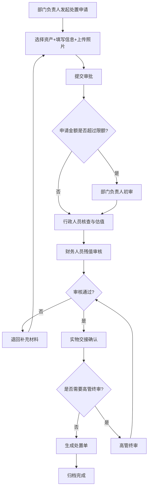

## 1. 产品概述

企业资产处置审批系统是面向企业行政、财务和部门负责人的内部管理平台，用于规范闲置设备报废、转让和拍卖流程，实现资产处置全流程数字化管控，提升资产管理效率与合规性。

- 核心目标：建立标准化的资产处置审批流程，实现从申请、估值、审批到归档的全链路可追溯管理
- 目标用户：企业行政人员、财务人员、各部门负责人
- 业务价值：规范资产处置行为、防范资产流失、提高审批效率、完善档案管理

## 2. 核心功能

### 2.1 用户角色

| 角色 | 权限说明 | 核心职责 |
|------|----------|----------|
| 部门负责人 | 发起处置申请、查看本部门资产、审批下级申请 | 提交处置申请、确认实物交接 |
| 行政人员 | 资产清单管理、估值记录、实物交接、处置单生成 | 资产核查、录入残值、登记交接、生成处置台账 |
| 财务人员 | 财务审批、估值审核、处置台账导出 | 残值审核、财务复核、导出报表 |
| 高管审批 | 最终审批大额或重要资产处置 | 终审决策 |

### 2.2 功能模块

1. **处置申请页**：选择待处置资产、填写处置原因、上传照片、关联使用部门、录入残值估算、发起审批
2. **资产清单页**：资产列表展示、状态筛选、批量操作、资产详情查看
3. **审批看板页**：待办/已办任务、审批流程节点展示、审批操作（通过/退回）、补充材料上传
4. **估值记录页**：估值历史、残值对比、估值详情、审核状态
5. **归档查询页**：历史处置记录、资产流向追踪、处置台账导出、高级搜索

### 2.3 页面详情

| 页面名称 | 模块名称 | 功能描述 |
|----------|----------|----------|
| 处置申请 | 资产选择器 | 从资产库中勾选待处置资产，支持搜索和批量选择 |
| 处置申请 | 申请表单 | 处置方式（报废/转让/拍卖）、处置原因、使用部门、预计残值、备注 |
| 处置申请 | 照片上传 | 支持拖拽上传、多图预览、删除重传 |
| 处置申请 | 审批流程 | 选择审批链、预览审批节点、提交申请 |
| 资产清单 | 数据表格 | 资产编号、名称、类别、原值、净值、使用状态、所在部门、购入日期 |
| 资产清单 | 筛选工具栏 | 按类别/状态/部门/日期范围筛选，关键词搜索 |
| 资产清单 | 批量操作 | 批量申请处置、批量更新状态、批量导出 |
| 资产清单 | 资产详情 | 完整资产信息、处置历史、照片查看 |
| 审批看板 | 待办任务列表 | 展示当前用户待审批事项，支持按紧急程度排序 |
| 审批看板 | 审批详情 | 申请信息、资产清单、审批流程时间线、审批意见输入 |
| 审批看板 | 审批操作 | 通过申请、退回申请（填写退回原因）、转交他人 |
| 审批看板 | 已办历史 | 已处理审批记录查看 |
| 估值记录 | 估值列表 | 估值编号、关联资产、估值方式、估值金额、估值人、估值日期、审核状态 |
| 估值记录 | 估值详情 | 估值依据、估值方法说明、对比分析、审核记录 |
| 估值记录 | 新增估值 | 录入估值信息、上传评估报告、提交审核 |
| 归档查询 | 处置台账 | 已完成处置记录列表，支持多维度筛选 |
| 归档查询 | 资产流向 | 单资产全生命周期追溯时间线 |
| 归档查询 | 高级搜索 | 组合条件查询、保存搜索条件 |
| 归档查询 | 导出功能 | 导出 Excel/CSV 格式处置台账 |

## 3. 核心流程

### 3.1 资产处置审批主流程

部门负责人发起处置申请 → 行政人员核查资产并估值 → 财务人员审核残值 → 部门负责人确认实物交接 → 高管终审（如超过限额）→ 行政生成处置单并归档

### 3.2 资产全生命周期

资产入库 → 领用分配 → 使用维护 → 闲置标记 → 处置申请 → 审批流转 → 处置执行 → 档案归档

## 4. 用户界面设计

### 4.1 设计风格

- **主色调**：深邃蓝（#1E3A5F）作为品牌主色，体现专业、稳重、可信赖的企业形象
- **辅助色**：青绿色（#0D9488）用于成功/通过状态，琥珀色（#D97706）用于警告/待办，玫红色（#DC2626）用于危险/退回
- **中性色**：暖灰色系（#F8FAFC, #F1F5F9, #E2E8F0, #94A3B8, #475569, #1E293B）
- **按钮风格**：圆角矩形（8px），主按钮带微渐变和阴影，hover 状态有细微上浮效果
- **字体**：标题使用思源宋体（Source Han Serif）体现正式感，正文使用思源黑体（Source Han Sans）保证可读性
- **布局风格**：卡片式布局，侧边导航 + 顶部工具栏 + 内容区三栏结构
- **图标风格**：线性图标（lucide-react），统一 24px 尺寸，颜色随语义变化

### 4.2 页面设计概览

| 页面名称 | 模块名称 | UI 设计要点 |
|----------|----------|-------------|
| 处置申请 | 整体布局 | 分步骤向导（Step Indicator），左侧表单右侧资产选择，卡片分区 |
| 处置申请 | 资产选择器 | 模态框展示资产表格，勾选交互，已选资产显示在底部悬浮条 |
| 处置申请 | 照片上传区 | 虚线边框占位，拖拽高亮，缩略图网格布局 |
| 资产清单 | 数据表格 | 斑马纹行、固定表头、状态标签胶囊样式、列宽可调整 |
| 资产清单 | 筛选区 | 折叠式筛选面板，标签式筛选条件展示 |
| 审批看板 | 时间线 | 垂直审批时间线，节点状态图标，当前节点高亮脉冲动画 |
| 审批看板 | 任务卡片 | 待办卡片带红色角标，悬停上浮，操作按钮组 |
| 估值记录 | 对比图表 | 柱状图展示原值-净值-估值对比，色块区分 |
| 归档查询 | 流向时间线 | 横向时间线，资产状态流转节点，鼠标悬停显示详情气泡 |

### 4.3 响应式设计

- 桌面端优先（1440px 基准设计）
- 平板端（1024px）：侧边栏收起为图标模式，表格横向滚动
- 移动端（768px）：顶栏折叠为汉堡菜单，卡片单列布局，表格转为列表视图

### 4.4 动效与交互

- 页面加载：内容区从下往上淡入位移（translateY 20px → 0，opacity 0 → 1）
- 卡片悬停：box-shadow 加深 + translateY -2px，过渡 200ms ease
- 按钮点击：scale 0.97 的微压缩反馈
- 状态标签：审批通过带勾选动画，退回带摇晃提示
- 审批时间线：当前节点呼吸灯脉冲效果
