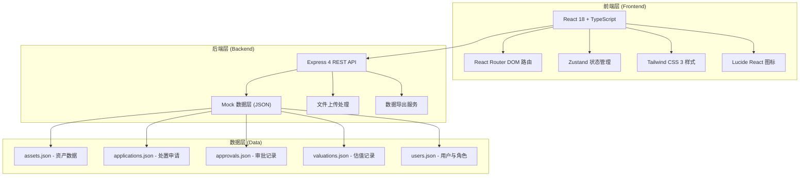
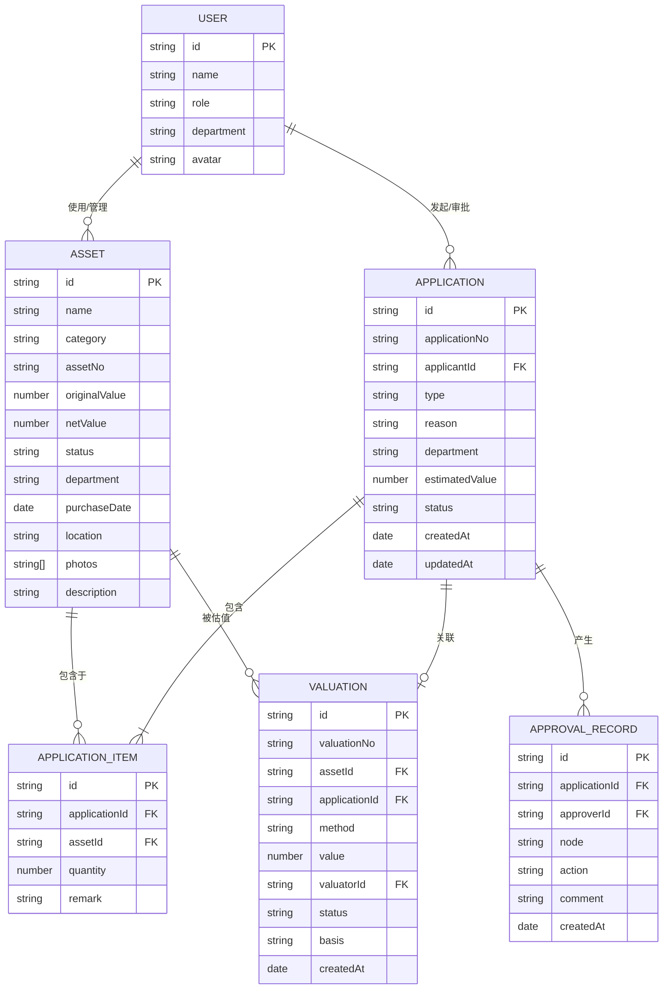

## 1. 架构设计



## 2. 技术选型说明

- **前端框架**：React@18 + TypeScript + Vite，提供类型安全与高性能开发体验
- **路由管理**：react-router-dom@6，SPA 多页面路由
- **状态管理**：zustand，轻量级全局状态，管理用户会话、审批任务、资产筛选条件
- **UI 样式**：tailwindcss@3，原子化 CSS，配合自定义主题
- **图标库**：lucide-react，线性风格图标库
- **后端框架**：Express@4 + TypeScript，提供 RESTful API
- **数据存储**：Mock JSON 文件，模拟持久化存储
- **构建工具**：Vite@5，快速热更新与构建

## 3. 路由定义

| 路由路径 | 页面名称 | 访问角色 | 说明 |
|----------|----------|----------|------|
| / | 首页/工作台 | 所有角色 | 数据概览、快捷入口、待办提醒 |
| /application | 处置申请 | 部门负责人、行政 | 发起新的资产处置申请 |
| /application/:id | 申请详情 | 相关审批人 | 查看单个申请详情与审批操作 |
| /assets | 资产清单 | 行政、财务、部门负责人 | 浏览和管理企业资产 |
| /assets/:id | 资产详情 | 行政、财务、部门负责人 | 单资产全生命周期信息 |
| /approval | 审批看板 | 所有审批角色 | 待办任务、已办历史、审批操作 |
| /valuation | 估值记录 | 行政、财务 | 估值列表、新增估值、审核 |
| /archive | 归档查询 | 行政、财务、高管 | 历史台账、流向追溯、导出 |
| /login | 登录页 | 所有 | 角色选择与模拟登录 |

## 4. 数据模型

### 4.1 ER 关系图



### 4.2 核心数据结构定义

```typescript
// 用户角色
export type UserRole = 'dept_head' | 'admin' | 'finance' | 'executive';

export interface User {
  id: string;
  name: string;
  role: UserRole;
  department: string;
  avatar: string;
}

// 资产状态
export type AssetStatus = 'in_use' | 'idle' | 'repairing' | 'pending_disposal' | 'disposed';

export interface Asset {
  id: string;
  name: string;
  category: string;
  assetNo: string;
  originalValue: number;
  netValue: number;
  status: AssetStatus;
  department: string;
  purchaseDate: string;
  location: string;
  photos: string[];
  description: string;
  custodian: string;
}

// 处置方式
export type DisposalType = 'scrap' | 'transfer' | 'auction';

// 申请状态
export type ApplicationStatus = 'draft' | 'pending_dept' | 'pending_admin' | 'pending_finance' | 'pending_handover' | 'pending_executive' | 'approved' | 'rejected' | 'returned' | 'completed' | 'archived';

export interface Application {
  id: string;
  applicationNo: string;
  applicantId: string;
  applicantName: string;
  type: DisposalType;
  reason: string;
  department: string;
  estimatedValue: number;
  status: ApplicationStatus;
  photos: string[];
  items: ApplicationItem[];
  currentNode: string;
  createdAt: string;
  updatedAt: string;
}

export interface ApplicationItem {
  id: string;
  assetId: string;
  assetName: string;
  assetNo: string;
  originalValue: number;
  netValue: number;
  quantity: number;
  remark: string;
}

// 审批记录
export type ApprovalAction = 'approve' | 'reject' | 'return' | 'transfer';

export interface ApprovalRecord {
  id: string;
  applicationId: string;
  approverId: string;
  approverName: string;
  approverRole: UserRole;
  node: string;
  nodeName: string;
  action: ApprovalAction;
  comment: string;
  createdAt: string;
}

// 估值记录
export type ValuationMethod = 'cost' | 'market' | 'income' | 'expert';
export type ValuationStatus = 'draft' | 'pending_review' | 'reviewed' | 'rejected';

export interface Valuation {
  id: string;
  valuationNo: string;
  assetId: string;
  assetName: string;
  assetNo: string;
  applicationId?: string;
  method: ValuationMethod;
  value: number;
  originalValue: number;
  netValue: number;
  valuatorId: string;
  valuatorName: string;
  status: ValuationStatus;
  basis: string;
  reportUrl?: string;
  createdAt: string;
}
```

## 5. API 接口定义

### 5.1 认证模块

```
POST   /api/auth/login              用户登录（模拟）
GET    /api/auth/profile            获取当前用户信息
```

### 5.2 资产管理

```
GET    /api/assets                  资产列表（支持筛选、分页）
GET    /api/assets/:id              资产详情
POST   /api/assets                  新增资产
PUT    /api/assets/:id              更新资产信息
PATCH  /api/assets/batch-status     批量更新资产状态
GET    /api/assets/:id/history      资产历史流向
```

### 5.3 处置申请

```
GET    /api/applications            申请列表（支持筛选）
GET    /api/applications/:id        申请详情
POST   /api/applications            创建处置申请
PUT    /api/applications/:id        更新申请（草稿状态）
POST   /api/applications/:id/submit 提交审批
GET    /api/applications/:id/approvals 审批流程记录
```

### 5.4 审批模块

```
GET    /api/approvals/todo          当前用户待办任务
GET    /api/approvals/done          当前用户已办任务
POST   /api/approvals/:id/approve   审批通过
POST   /api/approvals/:id/reject    审批驳回
POST   /api/approvals/:id/return    退回补充材料
POST   /api/approvals/:id/transfer  转交审批
```

### 5.5 估值模块

```
GET    /api/valuations              估值列表
GET    /api/valuations/:id          估值详情
POST   /api/valuations              新增估值记录
POST   /api/valuations/:id/review   审核估值
```

### 5.6 归档与导出

```
GET    /api/archive/disposals       已归档处置记录
GET    /api/archive/asset-flow/:id  资产流向追溯
GET    /api/archive/export          导出处置台账（Excel/CSV）
```

## 6. 项目目录结构

```
├── src/                          # 前端源码
│   ├── components/               # 通用组件
│   │   ├── layout/               # 布局组件（Sidebar, Header, Layout）
│   │   ├── common/               # 通用组件（Button, Modal, Table, Tag 等）
│   │   └── business/             # 业务组件（ApprovalTimeline, AssetCard 等）
│   ├── pages/                    # 页面组件
│   │   ├── Dashboard/            # 工作台首页
│   │   ├── Application/          # 处置申请
│   │   ├── Assets/               # 资产清单
│   │   ├── Approval/             # 审批看板
│   │   ├── Valuation/            # 估值记录
│   │   ├── Archive/              # 归档查询
│   │   └── Login/                # 登录页
│   ├── hooks/                    # 自定义 Hooks
│   ├── store/                    # Zustand 状态管理
│   ├── utils/                    # 工具函数
│   ├── types/                    # TypeScript 类型定义
│   ├── services/                 # API 请求服务
│   ├── mock/                     # Mock 数据
│   ├── router/                   # 路由配置
│   ├── App.tsx
│   ├── main.tsx
│   └── index.css
├── api/                          # 后端源码
│   ├── routes/                   # 路由
│   ├── controllers/              # 控制器
│   ├── middleware/               # 中间件
│   ├── data/                     # Mock JSON 数据文件
│   └── index.ts
├── shared/                       # 前后端共享类型
│   └── types.ts
├── vite.config.ts
├── tailwind.config.js
├── tsconfig.json
├── package.json
└── README.md
```

## 7. 角色权限矩阵

| 功能模块 | 部门负责人 | 行政人员 | 财务人员 | 高管 |
|----------|-----------|---------|---------|------|
| 发起处置申请 | ✅ | ✅ | ❌ | ❌ |
| 查看资产清单 | ✅(本部门) | ✅(全部) | ✅(全部) | ✅(全部) |
| 新增/编辑资产 | ❌ | ✅ | ❌ | ❌ |
| 录入估值 | ❌ | ✅ | ❌ | ❌ |
| 审核估值 | ❌ | ❌ | ✅ | ❌ |
| 部门审批 | ✅ | ❌ | ❌ | ❌ |
| 行政核查 | ❌ | ✅ | ❌ | ❌ |
| 财务审批 | ❌ | ❌ | ✅ | ❌ |
| 高管终审 | ❌ | ❌ | ❌ | ✅ |
| 实物交接确认 | ✅ | ✅ | ❌ | ❌ |
| 生成处置单 | ❌ | ✅ | ❌ | ❌ |
| 导出台账 | ❌ | ✅ | ✅ | ✅ |
| 查看归档 | ✅(本部门) | ✅ | ✅ | ✅ |
